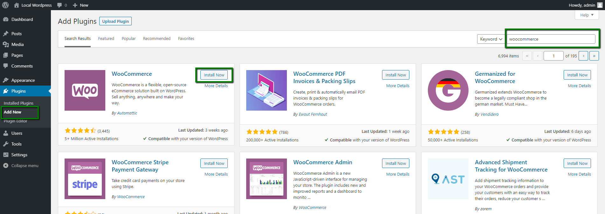
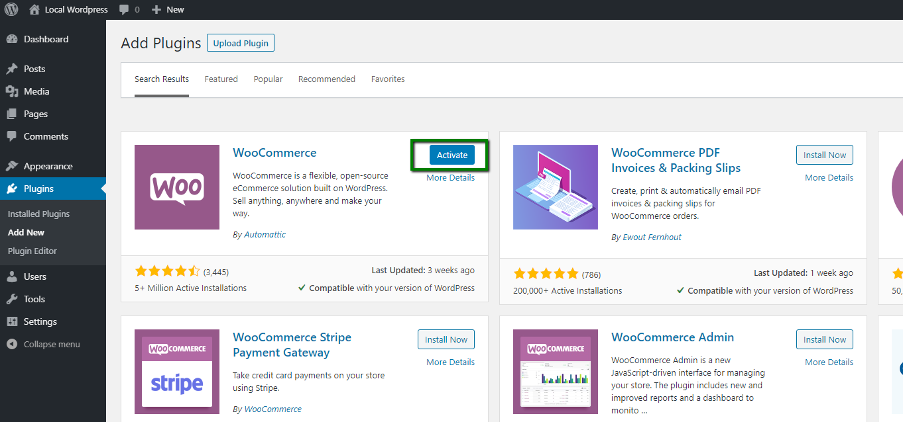
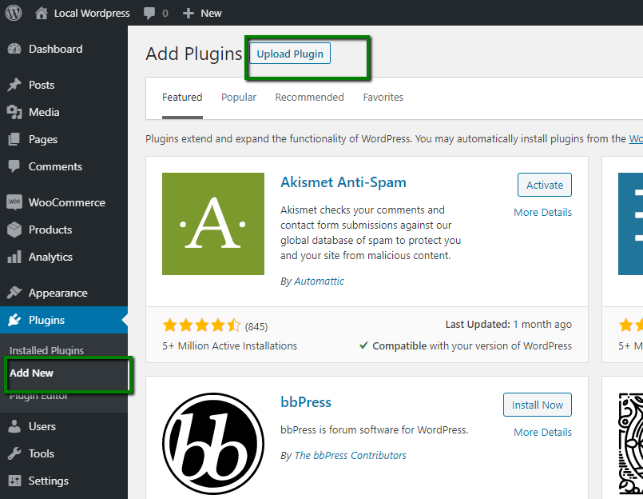
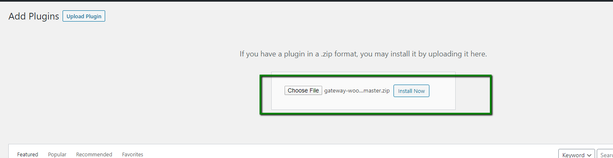
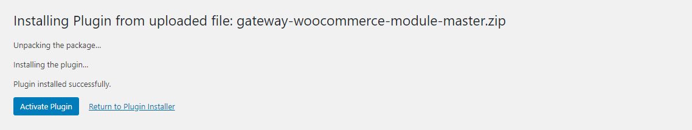
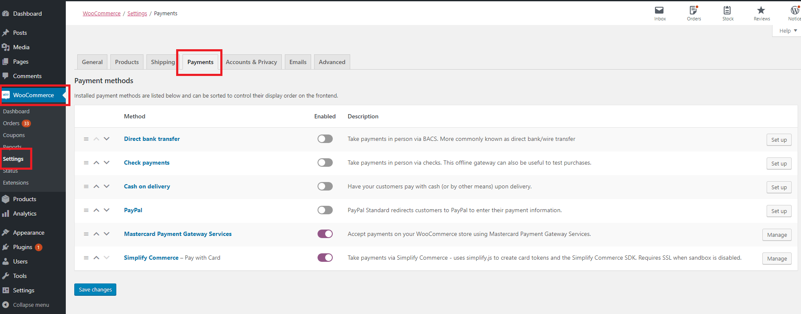
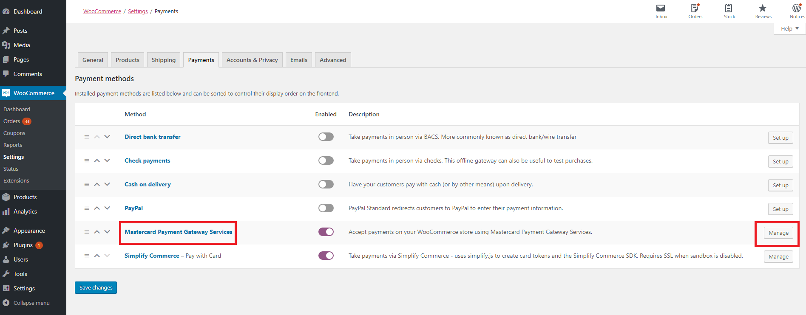
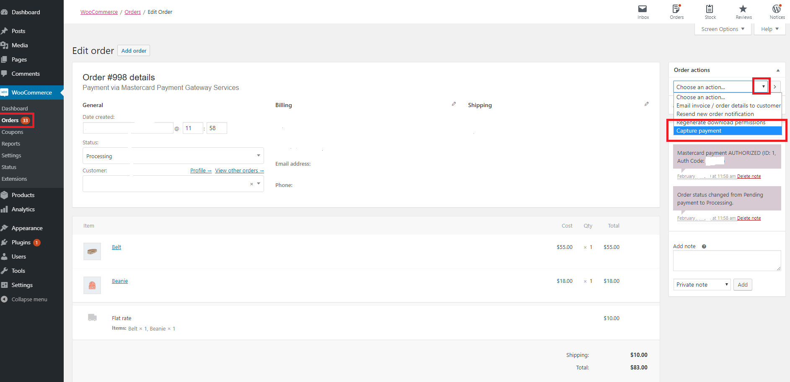

# Mastercard Payment Gateway Services module for WooCommerce

## Compatibility
The module has been tested with the WooCommerce versions:

- 3.9.3
- 4.0
- 4.8
- 5.1.0
- 5.5.1
- 5.5.2
- 6.0.0
- 6.2.1
- 6.4.0

The module has been tested with the WordPress versions:

- 5.2.4
- 5.3.2
- 5.6
- 5.7.2
- 5.9.1

## Customer Information Shared with Gateway

### This module shares the following customer information with the gateway:

- Customer Billing and Shipping Address
- Customer Name
- Customer Phone Number
- Customer Email Address
- Cart Line Items (optional)

## Feature Support

WooCommerce Mastercard Payment Gateway Service module supports following list of features:

- Card payments
- Alternative payment methods
- Hosted Session
- Hosted Checkout
- Full refunds
- Partial refunds
- AVS
- 3DSv1
- 3DSv2
- Tokenization

## Documentation

The official documentation for this module is available on: [http://ontap.wiki/woocommerce-mastercard-payment-gateway-services](http://ontap.wiki/woocommerce-mastercard-payment-gateway-services)

## Obtain the module
You can obtain the module by downloading a release from: https://github.com/Mastercard-Gateway/gateway-woocommerce-module/releases
## Installation of Module
To use WooCommerce MPGS for WordPress, you need to install both the MasterCard Payment Gateway Services module and the WooCommerce module. 
### Steps to install WooCommerce for WordPress:
Follow the below steps:
1. Connect to Backoffice of your shop with the available admin credentials.
2. Go to **Plugins > Add New** on your WordPress site.
3. Enter **WooCommerce** in the Search Plugins bar. 

4. Click **Install Now** and **Activate**.

5. Once the installation is complete, we need to configure the WooCommerce as per the steps in https://docs.woocommerce.com/document/woocommerce-setup-wizard/
### Steps to install MasterCard Payment Gateway Services for WordPress
Follow the below steps:
1. There are two ways to install the plugin into WordPress, either:
1.1 Download the gateway-woocommerce-module plugin zip file from https://github.com/Mastercard-Gateway/gateway-woocommerce-module/releases and extract to the /wp-content/plugins/ directory,
**or**
1.2. Connect to Backoffice of your shop with the available admin credentials and install the plugin through the WordPress plugins screen directly.
Goto: Admin => Plugins => Installed Plugins => Click on 'Add New' => Then in the Top click on "Upload Plugin" button.

1.2.1 Then choose the module zip and click on the 'Install Now' button.

2. Activate the plugin through the 'Plugins' screen in WordPress.
 Goto: Admin => Plugins => Installed Plugins => MPGS => Click on "Activate Plugin"

3. Go to the WooCommerce backend settings page.
4. Navigate to Payments tab, enable MPGS module and save changes then you are ready.
---
## Configuring the Module
Once you have installed the MasterCard Payment Gateway Services module, you can then configure it. 
### Steps to configure the module
1. Log into your WordPress Admin Panel.  
2. In the WordPress Admin Panel, select WooCommerce > Settings > Payments.

3. Locate "MasterCard Payment Gateway Services" and then click the "Manage" button.

3. The gateway configuration fields will be displayed. Configure according to your requirements and then click on the "Save Changes" button.
    - **Enable/Disable** - Tick the checkbox to make this Payment option available in the frontend. Un-tick it to Disable it, so it will not display in the frontend.
    - **Title** - Short payment method name displayed to the payer on the checkout page. Example, "Credit Card / Debit Card".
    - **Description** - Description of this Payment Method displayed when a payer selects this payment method. Example, "Pay with your card via Mastercard".
    - **Gateway** - The payment gateway region, use Custom Gateway Host if one has been provided to you. Four options are available: Europe, Asia Pacific. North America, and Custom URL.
    - **Custom Gateway Host** - This option is available when the "Gateway" option is set to "Custom Gateway Host" . Your Account Manager will tell you if this is needed or not.
    - **Transaction Mode** - In "Purchase" mode, the customer is charged immediately. In Authorize mode, the transaction is only authorized, and the capturing of funds is a manual process performed by you using the Woocommerce admin panel. The Manual capture process is explained in the next section.
    - **Integration Model** - In "Hosted Checkout" and "Legacy Hosted Checkout", the payer will type their details into the gateway"s payment page. In "Hosted Session", the payer will remain on the woocommerce payment page.
    - **Checkout Interaction** - This option is available when the "Payment Model" option is set to "Hosted Checkout" or "Legacy Hosted Checkout" and allows to set redirection behavior to the payment gateway. Either "Embedded" or "Redirect to Payment Page" for contemporary version Hosted Checkout or Either "Lightbox" or "Redirect to Payment Page" for Legacy Hosted Checkout.
    - **3D-Secure** - This option is available when the "Payment Model" option is set to "Hosted Session". Tick the checkbox of "Use 3D-Secure" to Enable it. Be sure to Enable 3D-Secure in your Mastercard account. Un-tick it to Disable it. Hosted Checkout will present 3D-Secure authentication when configured by your payment service provider.
    - **Saved Cards** - This option is available when the "Payment Model" option is set to "Hosted Session". Tick the checkbox of "Enable Payment via Saved Cards" to Enable it. If enabled, payer will be able to pay with a previously saved card during checkout. Card details are saved on payment gateway, not on your store. Un-tick it to Disable it.
    - **Debug Logging** - When ticked, the file ./wp-content/mastercard.log will include additional logging including all communication with the gateway. Debug logging is only available in test sandbox mode.
    - **Test Sandbox** - Tick the checkbox of "Enable Sandbox Mode" to Enable it. If enabled, it places the payment gateway in test mode using test API credentials (real payments will not be taken). Un-tick it to Disable it. If disabled, it will take the real payments.
    - **Merchant ID** - Insert your account Merchant ID. Gateway Merchant Administrator: Admin > Integration Settings.
    - **API Password** - Insert your API Password. Gateway Merchant Administrator: Admin > Integration Settings.
---
## Capture an Order
### Steps to process a capture transaction on an order
1. Edit the order in the admin. Path: Admin >  WooCommerce > Orders > Edit Order 
2. On the right side of the order, you can open a dropdown menu and select "Capture Payment". Ensure the order is authorized, (see Order Notes, right side of the order page), otherwise an already captured order will not have the "capture" option.

3. After selecting "Capture Payment" as option, click the "Update" button to capture funds for this order.
---
